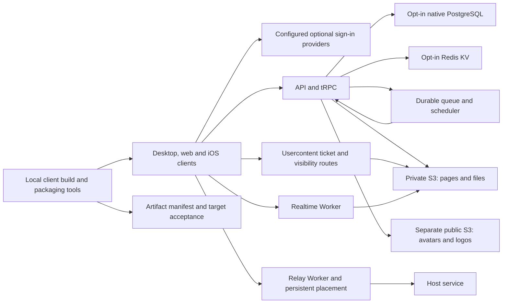

# Self-host capabilities and completion evidence

The one-commit combined source on [review/verified-composition-20261007](https://github.com/temporaryfix/superset/tree/review/verified-composition-20261007) ([ef1ac91f](https://github.com/temporaryfix/superset/commit/ef1ac91f4632f7ed26f822d80e787d3adac41e3f)) integrates all seven proposals for reproduction without another PR. Shared graph evidence applies to that composition; focused proposal checks are recorded separately.

[PR #8237](https://github.com/superset-sh/superset/pull/8237) adds optional service adapters and local client tooling. [#8231](https://github.com/superset-sh/superset/pull/8231) supplies configured desktop storage origins; [#8233](https://github.com/superset-sh/superset/pull/8233) documents PostgreSQL development storage and rollback. [Tracking issue #8241](https://github.com/superset-sh/superset/issues/8241) links the related review work and original app gallery.

One-commit self-host candidate `97aaeb4ea39e09f70f021743fe6417cb50be6049` targets upstream `2dda82c314606aaa099b8626150c61450d66b629`. The optional adapters preserve the managed-provider path when disabled. Private page/file objects and public avatar/logo objects use separate buckets. The diagram describes the implemented configuration and request contracts; actual acceptance results follow it.

## Resulting behavior

| Capability | Completion behavior | Concrete check |
|---|---|---|
| Native PostgreSQL | Uses the direct unpooled URL. Maintenance scripts normalize native-array and Neon-envelope results. | Actual native exports execute queries, commit/roll back transactions and serialize advisory locks. The combined-source DB package passed 35 cases/212 assertions with zero skips/failures. Status-repair fixtures also cover dry-run/apply for both result shapes. |
| Redis and queue | Redis configuration accepts redis/rediss schemes. Publication commits durable SQLite storage before acknowledgement. Four workers refill freed slots; token-fenced leases prevent stale acknowledgements changing new claims. Exhaustion and failure callback insertion commit together. | Actual pinned Valkey passed seven cases/69 assertions with zero skips/failures: five native cases made zero HTTP requests and two managed-provider cases passed. Queue regressions cover fast-job refill behind a slow job, concurrent claims, expired lease recovery, stale acknowledgements, locked writes and callback recovery. Native Slack publication uses a two-second acknowledgement deadline. |
| Public/private storage | Private reads/presigning keep their bucket boundary; images explicitly use the separate public bucket. Image replacement saves the row before reclaiming the old image and awaits cleanup. A failed save awaits reclamation of the new upload. Deletion concurrency is bounded to four. | Deferred cleanup/save-failure fixtures, public/private SDK command assertions and bounded deletion transport tests passed. Generic S3 repointing emits the original public object URL. |
| Garage credential retention | Existing keys must match supplied credentials before policy reconciliation. Private/public aliases must resolve to different buckets. Documented rotation uses a new key. | Real pinned Garage v2 cases passed for new key, retained matching key, mismatched-key refusal and new-key rotation. |
| Worker configuration | Usercontent/realtime/relay renderers validate origins, ticket secrets and bounded exact-IP private exceptions. Config output is private, fsynced and atomically replaced. Relay refuses template/output aliases before persistent writes. | Endpoint query/fragment and 31/32-character ticket-secret regressions passed; additional alias, filesystem-error and malformed-port cases passed. |
| Worker images | The configurable runner base explicitly requires Debian Node 24 and UID/GID tools. Existing relay prune patches and workerd selector contracts remain intact. | A pinned Debian Node 24 remap passed. A scratch context image retained eight allowed dummy files/templates and excluded 15 credential/state sentinels; removing the ignore rule made its negative control fail. |
| Optional auth and analytics | Configured provider actions and Apple capability share the mobile provider list. Blank Authentik credentials disable that provider. Sign-in content scrolls when provider rows exceed available space. Analytics opt-out produces no client, request or warning; configured flags retain their actual SDK behavior. | Actual provider/action fixtures cover hosted defaults, blank/unknown inputs, selected providers and all five supported mobile providers with development controls. Configured, disabled and unknown flag cases passed using the actual quiet wrapper; combined mobile fixtures passed 38 outer cases, and auth/config fixtures passed 41 outer plus 90 genuine app-config cases. |
| Billing disabled | Unconfigured billing disables subscription operations, returns neutral billing reads and explicitly refuses portal creation. Stored customer IDs cannot trigger Stripe through organization or member lifecycle. Team admission no longer requires an unavailable upgrade. | Ten actual router/hook/plugin cases passed: disabled retained-customer paths made zero SDK calls; configured reads/portal and lifecycle calls remained active. |
| Build inputs and packaging | Runtime secrets pass through without invalidating unrelated cached artifacts. Public mobile output settings affect mobile task hashes; Apple association inputs affect the web build. Child output resolves after stream closure. CLI staging requires nonempty essential runtimes, addons, helpers and migrations. Packaged-module containment handles Windows/POSIX paths. | Real Turbo dry-run hash comparisons, grandchild stdout/JSON-tail drainage, precise truncation regressions and serialized containment probes passed. Foreign target/native slices retain explicit target-runtime acceptance. |
| Expo Swift interop | Faithful three-file Bun backport of [official Expo fix #51040](https://github.com/expo/expo/pull/51040) to pinned ExpoModulesJSI 57.1.1: private constructors, retained factories and pointer-capture wrappers. Existing retain/release bodies and SDK versions remain intact. | Genuine installed package passed one native case/19 assertions: Swift header import, C++ dispatch/retain-release, escaped copied Swift owners in both `-Onone` and `-O` with AddressSanitizer. Incorrect-unretained control compiled but failed the ownership assertion. |

## Acceptance evidence

Actual native PostgreSQL acceptance exercises both exported clients against disposable PostgreSQL: query execution, committed/rolled-back transactions and advisory-lock serialization passed. The combined-source DB package passed 35 cases/212 assertions with zero skips/failures. The focused queue, billing, auth, storage/configuration and packaging tests execute their actual router/hooks/components or command boundaries with controlled transports and dummy credentials.

Actual pinned Valkey acceptance passed seven cases/69 assertions with zero skips/failures in 427 ms. The five native cases used the actual service and verified Upstash-compatible serialization, TTL, conditional set, GET/delete, 16 concurrent reads/writes and `NOSCRIPT` recovery without HTTP calls. Twelve rate-limit calls admitted exactly three; two managed-provider cases passed. The disposable container was removed.

The candidate usercontent image built in 49.4 seconds; Garage v2 Worker acceptance passed all three cases/49 assertions: public-page access, unauthorized/private ticket refusal and file/range access. The matching nondefault ticket secret included literal equals and meaningful whitespace. Runtime UID 1001 was verified, and all seven owned resources were absent after cleanup.

The installed Expo 57.1.1 native fixture checks explicit retained factory ownership rather than deleting annotations: two copied owners survive the original factory scope and produce exactly two allocations/destructions in each Swift optimization mode. C++/Swift AddressSanitizer and the incorrect-unretained negative control verify the ownership boundary. Supported full SDK 57 builds use [Xcode 26.4+](https://docs.expo.dev/versions/v57.0.0/#support-for-android-and-ios-versions), as documented by the client release tooling.

Final focused self-host checks: Final combined graph: all 42 compiler/declaration/catalog tasks passed; full lint passed 9,927 files. Exact self-host candidate Docker build and real Garage/Worker acceptance passed three cases/49 assertions; all seven owned resources were removed. Actual native PostgreSQL query/transaction/lock cases, Valkey native/managed cases, queue/storage/billing/provider fixtures and real Swift/ASan ownership checks passed. The source-only composition linked in #8241 reproduces shared optional-provider contracts.. Combined consumer/declaration/catalog checks: All 42 compiler/declaration/catalog tasks passed, with 17 fully translated shipping catalogs (6,184 messages each); repository-wide lint passed 9,927 files. Changed-test acceptance across all 17 groups passed 2290 cases with zero unresolved failures, including API 185, desktop 290, mobile 102, host 696 and tRPC 399. The native Node 22 worker and installed glab cases ran; all five optional native Redis cases also passed separately against disposable Valkey (seven total Redis cases/69 assertions, zero skips). Counts are outer cases; nested caller/component cases are recorded separately.. The single shared external-acceptance/provenance statement is in [tracking issue #8241](https://github.com/superset-sh/superset/issues/8241).

## Visual walkthrough

The [24 original app captures](README.md#full-visual-gallery) show configured GitLab client surfaces, with [capture provenance](screenshot-notes.md). Most self-host changes affect adapters, configuration and artifacts rather than adding an administration screen; the actual service/ownership checks above establish those capabilities.
