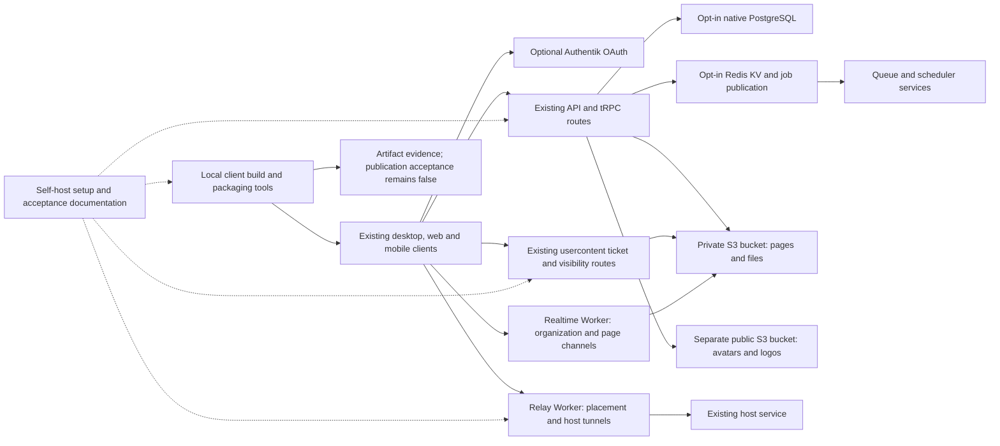

# Self-host capabilities: source-based visual overview

This is an explanatory diagram and source guide for [PR #8237](https://github.com/superset-sh/superset/pull/8237), with the desktop storage policy in [#8231](https://github.com/superset-sh/superset/pull/8231) and development database guidance in [#8233](https://github.com/superset-sh/superset/pull/8233). It is **not a runtime screenshot or an operational architecture acceptance report**. Arrows describe configurable source contracts; they do not claim that services were deployed or connected.

The optional adapters preserve the existing managed-provider path when disabled. The private/public storage split is deliberate: page and file reads keep the existing ticket/visibility checks, while avatar/logo objects use the separate public store. The diagram groups components by responsibility rather than prescribing a complete Compose or ingress deployment.

## What changed in source

| Capability | Reviewable behavior | Public source |
|---|---|---|
| PostgreSQL | Native driver selection is opt-in; the review fix uses the direct connection URL. Read normalization supports both native arrays and Neon envelopes. | [DB client](https://github.com/superset-sh/superset/blob/c321235d278eb1fec4d5a50b5fcfd46602703c43/packages/db/src/client.ts), [maintenance script](https://github.com/superset-sh/superset/blob/c321235d278eb1fec4d5a50b5fcfd46602703c43/packages/trpc/scripts/align-default-statuses.ts) |
| Redis and jobs | Optional Redis-backed KV and native job publication, plus separate queue/scheduler services. Bounded draining and Slack enqueue timing remain review follow-ups. | [KV adapter](https://github.com/superset-sh/superset/blob/c321235d278eb1fec4d5a50b5fcfd46602703c43/packages/shared/src/kv.ts), [job image guide](https://github.com/superset-sh/superset/blob/c321235d278eb1fec4d5a50b5fcfd46602703c43/docs/self-host/JOBS_IMAGES.md) |
| S3 and image cleanup | Generic S3 adapters separate private page/file content from public avatars/logos. Replacement retains the old object until the new row is saved; failed saves reclaim the new object. Cleanup lifetime and retained-key rotation still need follow-up. | [Storage guide](https://github.com/superset-sh/superset/blob/c321235d278eb1fec4d5a50b5fcfd46602703c43/docs/self-host/STORAGE.md), [replacement lifecycle](https://github.com/superset-sh/superset/blob/c321235d278eb1fec4d5a50b5fcfd46602703c43/packages/trpc/src/lib/upload.ts) |
| Usercontent and realtime | Self-host wrappers preserve the actual existing Worker routes and ticket/visibility contracts, adding a signed read-only private S3 adapter. Real workerd persistence and WebSocket acceptance remain separate. | [Usercontent entry](https://github.com/superset-sh/superset/blob/c321235d278eb1fec4d5a50b5fcfd46602703c43/docker/self-host/usercontent-entry.js), [realtime guide](https://github.com/superset-sh/superset/blob/c321235d278eb1fec4d5a50b5fcfd46602703c43/docs/self-host/REALTIME.md) |
| Relay | A separate Worker image retains host tunnel routes and adds persistent placement storage configuration. The actual prune already supplies install patches. | [Relay guide](https://github.com/superset-sh/superset/blob/c321235d278eb1fec4d5a50b5fcfd46602703c43/docs/self-host/RELAY.md), [image](https://github.com/superset-sh/superset/blob/c321235d278eb1fec4d5a50b5fcfd46602703c43/docker/self-host/relay.Dockerfile) |
| Optional OAuth and analytics | Optional Authentik actions appear in existing sign-in surfaces. Analytics can be configured or disabled. Mobile capability/button alignment and quiet feature-hook opt-out still need follow-up. | [Optional provider contract](https://github.com/superset-sh/superset/blob/c321235d278eb1fec4d5a50b5fcfd46602703c43/packages/auth/src/optional-providers.ts), [mobile sign-in screen](https://github.com/superset-sh/superset/blob/c321235d278eb1fec4d5a50b5fcfd46602703c43/apps/mobile/screens/%28auth%29/sign-in/SignInScreen.tsx) |
| Client tooling and maintenance | Local launchers invoke existing build commands, validate public build inputs, and record artifact evidence without publication. Pushed packaged-runtime fixes retain native probes and mark foreign/other universal slices pending. Unused helper cleanup is a separate low-priority review item. | [Client guide](https://github.com/superset-sh/superset/blob/c321235d278eb1fec4d5a50b5fcfd46602703c43/docs/self-host/CLIENT_RELEASE.md), [launcher](https://github.com/superset-sh/superset/blob/c321235d278eb1fec4d5a50b5fcfd46602703c43/scripts/client-packaging/client-packaging.ts) |

The links above identify the current amended public source. Pushed corrections are summarized in [review-feedback.md](review-feedback.md), including their exact review heads and focused validation. This overview adds no endpoints, account identifiers, infrastructure inventory, or credential values.

## What real screenshots can demonstrate

| Surface | Honest visual claim | Acceptance that remains separate |
|---|---|---|
| Existing web sign-in/sign-up and desktop sign-in | A configured Authentik action renders in the existing screen; show the actual pending/error state only if exercised. | Completed OAuth, callback/deep-link handling, persisted sessions. |
| Existing mobile sign-in | The configured provider actions render in the actual app build. Caption any unsupported visible action as a review defect. | Native entitlements, physical-device authentication, Release launch. |
| Existing avatar/logo and page/file views | A fixture image or document renders after an action actually completed. | Private-bucket denial, signature/CORS behavior, ticket isolation, cleanup and persistence. |
| Terminal/configuration output | An actual local check completed, with its command, source head, target and observed result shown. Label static configuration and diagrams accordingly. | Server deployment, live connectivity, native packaging, signing, update installation. |

If a loopback flag-response fixture is used to reveal the cloud chooser or editor, label the capture **fixture flags only**. It demonstrates the actual client UI under supplied flag responses; it does not prove access to a real flag service, cloud provisioning, paid workspace creation, or backend cloud authorization.

Most changes are backend adapters, configuration, packaging and documentation. There is no new general self-host administration screen in this PR. Existing app screens can illustrate the configured client; a rendered screen alone cannot verify PostgreSQL, Redis, storage, relay or release acceptance.
